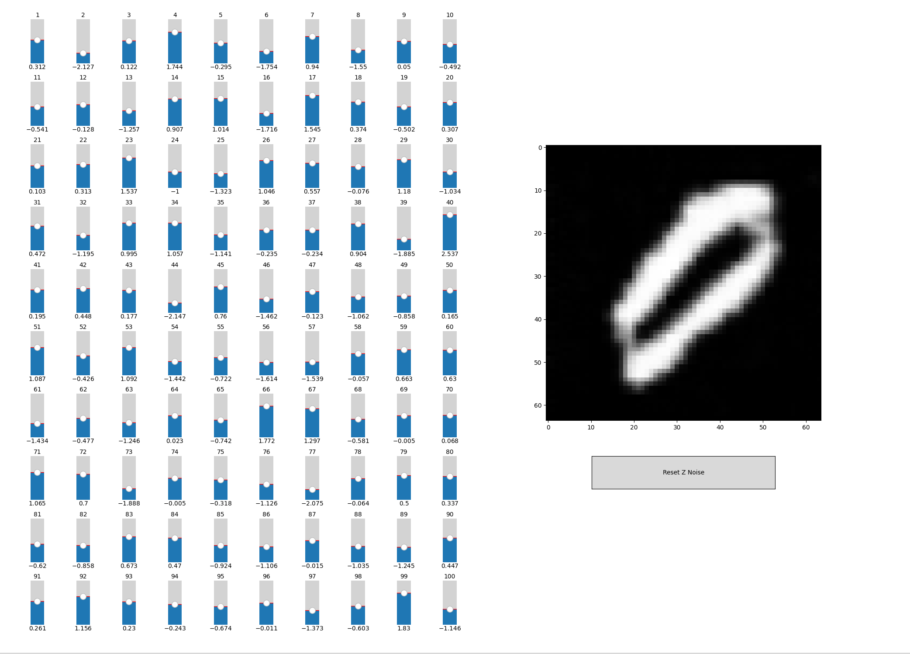
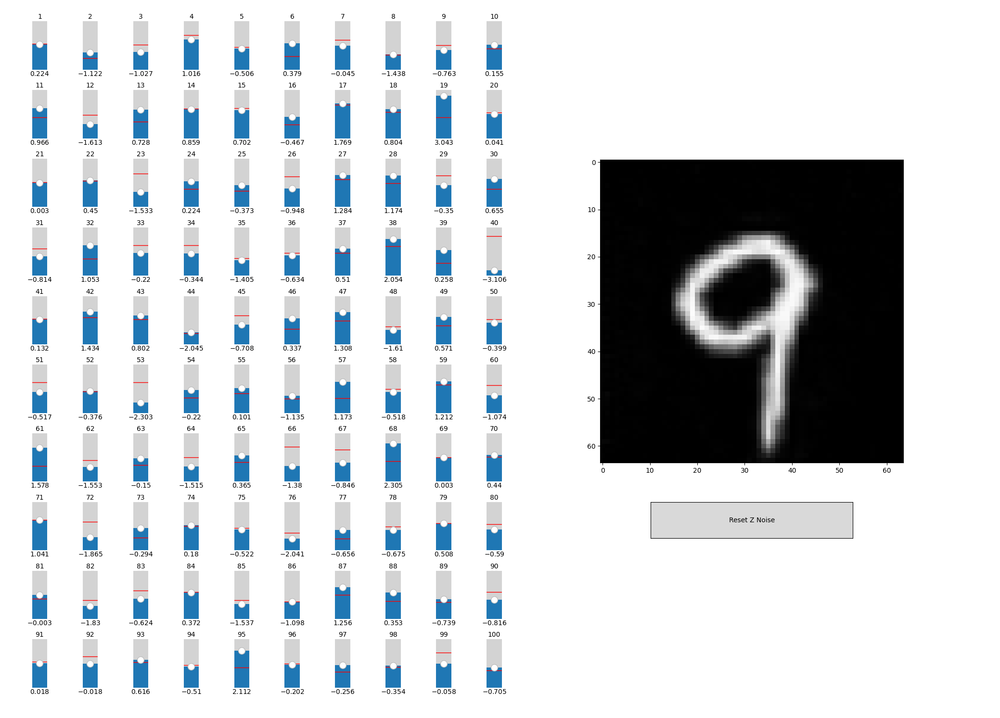
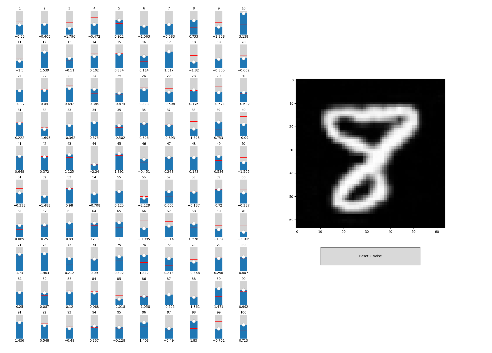

## Installation
   ### Setup Venv
   ### Install PyTorch
      (For CUDA)`pip3 install torch torchvision --index-url https://download.pytorch.org/whl/cu130`\
      (For CPU)`pip3 install torch torchvision --index-url https://download.pytorch.org/whl/cpu`
   ### Install Dependencies
      `pip install -r requirements.txt`
   ### Run Code
    `python main.py`

## How It Works

